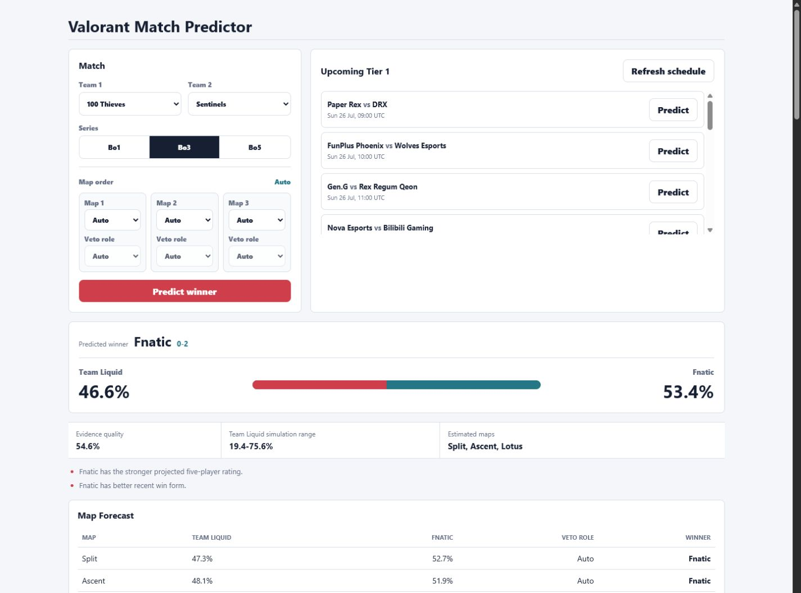
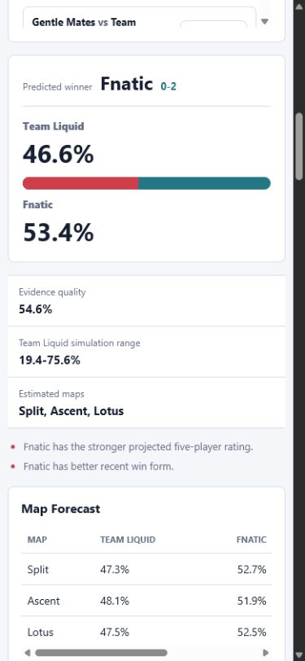

# Valorant Match Predictor

This project predicts a rating range for each player, map-win probabilities, and a calibrated series-win probability using:

1. Recent and longer-term player performance from VLR match stat pages.
2. Opponent-adjusted team Elo, recent team form, head-to-head history, map-pool form, and map-veto context.
3. Current roster continuity and lineup availability.
4. Structured VLR news events such as injuries, benchings, returns, roster moves, and substitutes.

The result keeps evidence quality separate from win probability. A prediction can favor one team while still reporting weak data, uncertain lineups, or wide player-rating intervals.

## Setup

Install the packages used by the scraper:

```powershell
pip install -r requirements.txt
```

Start the pinned local `vlrggapi` helper used for official VCT event discovery:

```powershell
docker compose up -d
docker compose ps
```

The helper listens only on `http://127.0.0.1:3001`. Docker downloads the
immutable upstream commit listed in `THIRD_PARTY.md`; its source is not copied
into this repository. The direct VLR parser remains responsible for player-map
statistics because those tables are not consistently populated by the API.

The code is organized as an importable package under `src/valorant_predictor`. Use the scripts in `scripts/` from the project root for normal workflows.

## Project Layout

```text
src/valorant_predictor/   Core scraper, features, training, and prediction code
web/                      Flask app, templates, and static assets
scripts/                  Command entry points
data/                     CSV inputs and prediction outputs
artifacts/models/         Trained model files and training metrics
archive/old_scrapers/     Early scratch scrapers and experiments
infra/vlrggapi/            Reproducible wrapper for the pinned helper service
```

## Collect Data

Seed the VCT Tier 1 registry first. This stores the 48 Tier 1 teams and resolves their VLR team URLs when VLR search is reachable:

```powershell
python scripts\seed_teams.py
```

Discover the selected season on each active Tier 1 team's VLR match page, then scrape only Tier 1-v-Tier 1 and Ascension results:

```powershell
python scripts\scrape.py --matches --season-year 2026
```

Import the curated 2025 VCT season by official event ID:

```powershell
python scripts\import_vct.py --season-year 2025
```

This imports VCT Americas, EMEA, Pacific, China, Masters, and Champions. Only
Ascension matches involving a team promoted into the next Tier 1 season are
retained, with a lower competition weight. Event metadata comes from
`vlrggapi`; unseen player/map rows still come from the direct VLR match parser.

There is no default per-team cap. Candidate cards are filtered by date, explicit Tier 2/Game Changers labels, and the season-specific Tier 1 registry before their match pages are requested. Match rows are saved to `data/vlr_matches.csv`. Each row represents one player's stats on one map; VLR's duplicate `?game=` links and the `All Maps` aggregate table are excluded. Previously stored known-season matches that fail the registry rule are preserved in the ignored `data/vlr_matches_excluded.csv` archive instead of entering training. Coverage is saved to `data/vlr_match_coverage.csv` and counts unique match IDs for the selected season. The 20-match value is a data-quality benchmark only; it never excludes a team or prevents training.

CSV files remain the portable import/export layer. Scrapes and predictions are also synchronized to `data/valorant_predictor.sqlite3`, which keeps normalized match, map, player-map, roster, news-event, prediction, dataset-version, and model-run tables.

Updates merge into the existing CSV. Complete matches are reused, unseen matches are downloaded, and newly downloaded versions replace legacy rows for the same match ID. Use `--replace-history` only when you intentionally want a fresh file, or `--refresh-existing` to re-download complete matches.

The direct VLR parser records the veto note, map picker, decider, and veto order when VLR exposes them. Missing veto data does not make an otherwise complete match download again. The bundled self-hosted [vlrggapi](https://github.com/axsddlr/vlrggapi) service remains the source for official event discovery. Its expensive match-detail enrichment is manual and normally unnecessary:

```powershell
$env:VLRGGAPI_BASE_URL = "http://127.0.0.1:3001"
python scripts\scrape.py --matches --refresh-existing --use-vlrggapi-enrichment
```

Normal team-page updates do not contact the helper. When enrichment is explicitly enabled, the scraper checks it once and falls back to direct VLR parsing when unavailable. Existing historical rows are kept and marked `legacy`/`unknown` until refreshed; the app never invents old vetoes.

Files produced by the older scraper are marked as legacy because they do not contain map IDs. The first repaired update re-downloads those recent matches; only map-complete matches count toward the coverage target.

Scrape recent VLR news:

```powershell
python scripts\scrape.py --news --news-pages 3
```

Scrape current VLR rosters:

```powershell
python scripts\scrape.py --rosters
```

Scrape the current Tier 1 schedule from VLR:

```powershell
python scripts\scrape.py --upcoming
```

You can collect matches, news, rosters, and the schedule together:

```powershell
python scripts\scrape.py --matches --news --rosters --upcoming --news-pages 3
```

## Predict Player Ratings

Example:

```powershell
python scripts\predict_player_ratings.py --team1 "Gen.G" --team2 "Sentinels" --refresh-news --refresh-rosters
```

The command writes `data/predicted_player_ratings.csv`.

## Predict A Match Winner

Example:

```powershell
python scripts\predict_match.py --team1 "Gen.G" --team2 "Sentinels" --best-of 3 --refresh-news --refresh-rosters
```

Use trained models after running `scripts\train.py`:

```powershell
python scripts\predict_match.py --team1 "Gen.G" --team2 "Sentinels" --best-of 3 --use-trained-models
```

When the veto is known, pass the maps in play order. This removes map-selection uncertainty and is more accurate than asking the model to estimate the veto:

```powershell
python scripts\predict_match.py --team1 "BBL Esports" --team2 "NRG" --best-of 3 --maps Haven Breeze Lotus --use-trained-models
```

The command writes two files:

- `data/predicted_player_ratings.csv`
- `data/match_prediction.csv`

It prints:

- Predicted winner
- Win probability for each team
- Team strength table
- Key reasons for the pick
- Predicted rating for current active roster players
- `used_in_lineup` for the five players used in team strength
- Roster uncertainty for new or unknown roster pieces
- An 80% interval around every player rating
- A likely series score and simulated win-probability range
- A probability and likely winner for every selected or estimated map
- Evidence quality and selected-versus-estimated map context

## Web App

### Screenshots

**Desktop overview**



**Mobile prediction**



Run the Flask app:

```powershell
python scripts\run_web.py
```

Then open:

```text
http://127.0.0.1:5000
```

The web app can run predictions, choose an explicit map order for Bo1/Bo3/Bo5, update data, compare candidate models, and display series, map, team, player, and power-ranking forecasts. Leave every map on **Auto** before a veto; select every map after a veto is known. Partial or duplicate map selections are rejected.

Power rankings score every unique pairing among the 48 active Tier 1 teams as a neutral Bo3 with the deployed series model. A team's power score is its average predicted win probability against the other 47 teams. Regional tabs filter that globally comparable score and assign a regional position; raw database win totals do not determine rank. The cached ranking snapshot is rebuilt after every database update or training run, while the previous snapshot remains available during the background job.

Use **Update database & model** to resume missing 2025 event matches, merge new 2026 matches and player-map rows, preserve and refresh rosters, update news and the upcoming schedule, then retrain only when the usable dataset or model choice changed. The job runs in the background and reports progress in the page.

Use **Train & evaluate** to force a fresh chronological evaluation without scraping. Each task can stay on **Auto** or use a manually selected candidate. Auto chooses on the validation period, evaluates once on the later untouched test period, and falls back to the baseline when a match/map candidate misses the held-out log-loss and Brier safeguards. A manual override remains visibly marked even when it misses those safeguards.

The 2025 and 2026 team registries are season-specific. Unclassified matches are usable only when both opponents belong to that season's Tier 1 registry; this prevents Tier 2 opponents from leaking in through a Tier 1 team's general match page. Coverage below 20 games is an evidence-quality warning, not a minimum or maximum training limit.

You can run the same team setup from the terminal:

```powershell
python scripts\seed_teams.py
```

## Train Models

Train the player-rating, series-win, and map-win models on every stored match up to the selected season:

```powershell
python scripts\train.py --season-year 2026 --recent-days 60 --refresh-matches
```

This writes:

- `artifacts/models/player_rating_model.pkl`
- `artifacts/models/team_win_model.pkl`
- `artifacts/models/map_win_model.pkl`
- `artifacts/models/training_metrics.json`

The trainer fingerprints the usable dataset and skips retraining when neither the data, model version, nor requested model selection changed. Pass `--force` or use **Train & evaluate** to rebuild deliberately.

The player trainer compares squared-loss gradient boosting, absolute-loss gradient boosting, and Extra Trees on a chronological calibration fold. It predicts the residual change from a leakage-safe last-10 baseline and trains separate lower and upper quantile models for the rating range.

The series trainer compares direct logistic feature fusion, direct gradient boosting, a neutral residual learner, and XGBoost. Auto applies a simplicity margin: a more complex candidate must improve development log loss by at least `0.005` before replacing logistic regression. It also tests regularized regional offsets and a player-stacked feature set containing projected lineup mean, floor, ceiling, correction, reliability, and coverage. The stacked values are expanding-window out-of-fold (OOF) player predictions: the player model producing a historical feature never trained on that match. Elo is one point-in-time input and an evaluation baseline, not the probability anchor.

Model and feature-set selection combines the latest pre-test calibration window with older rolling windows, weighted 65/35 toward the latest period. Every candidate is then compared on the same later chronological holdout using accuracy, log loss, and Brier score, but those comparison results do not affect Auto selection. Both sides of every match remain in the same split. A regional, player-stack, calibration, or ensemble challenger that wins development but fails to improve the later holdout is rejected in favor of the simpler passing model.

The optional OOF probability ensemble combines four strictly pre-match probabilities: direct series fusion, map-derived series probability, dynamic Elo strength, and a separate lineup/player projection model. Its no-intercept logistic meta-model is trained only on expanding-window OOF component predictions. It is deployed only when it improves both development and untouched-test log loss and Brier score.

The map trainer separately compares a map-residual model, a direct gradient-boosted classifier, and logistic regression. Its historical team anchors are also expanding-window OOF predictions, converted from series probability to equivalent per-map probability before map-form and veto adjustments. Early rows without enough prior history fall back to Elo and carry an explicit OOF-availability feature.

Series calibration compares neutral shrinkage plus temperature scaling, symmetric Platt scaling, and symmetric beta calibration. A selected calibration method is reverted if it worsens both log loss and Brier score on the later holdout. Team perspectives remain exactly complementary. Map candidates remain team-anchored, reliability-scaled, and capped so sparse map history cannot overpower overall team quality.

A trained series model is enabled only when it beats its baseline on held-out log loss and Brier score and is supported by either the latest pre-test window or enough rolling windows. A map learner must beat its team-anchored baseline on both held-out and rolling safeguards. Otherwise the predictor falls back to the explainable baseline.

The web app shows a 20-game coverage benchmark in the Tier 1 Teams panel. Low coverage means confidence should be lower; all valid available rows are still used.

Training uses:

- Curated Tier 1 history plus discounted promotion evidence, with no arbitrary minimum or maximum training-row limit
- A 365-day sample-weight half-life, so an otherwise equal one-year-old example has half the influence of a current example
- Modest event-importance weights, capped so playoffs and LAN matches matter more without dominating the data
- Last 60 days as a recent-form feature
- Only matches before the target match when building features
- Chronological train/calibration/test splits grouped by match, so mirrored team rows and players from one match cannot leak across folds
- Expanding-window OOF player predictions for team-model stacking and OOF team probabilities for map-model anchors
- Dedicated map examples with map identity, map form, opponent interaction, picker/decider context when known, and roster state
- Candidate-model selection on calibration data, followed by one final evaluation on later test data
- Rolling-origin backtests to measure stability across several points in time
- Last-10 player form, coin-flip probability, and Elo as explicit baselines
- Accuracy, MAE, log loss, Brier score, and skill against those baselines
- Low-variance baseline blending plus symmetric temperature, Platt, and beta calibration candidates
- Match-grouped bootstrap 95% intervals for accuracy, log loss, and Brier score
- Selective-accuracy audits at 55%, 60%, and 65% predicted confidence
- Same-holdout history tests comparing all clean seasons with current-season-only training
- Quantile intervals adjusted on calibration data and measured on untouched test data

Old player and team history is retained because it can still contain useful matchup and identity information, but it is never treated as equally current. VLR's 60-day player/agent view remains a recent-form feature rather than the whole model.

## How The Rating Works

Base rating starts near `1.00`, similar to common esports stat ratings.

It uses:

- VLR Rating 2.0 when available
- A time-decayed 60-day rating blended with a slower 180-day stability estimate
- Last 3, last 5, and last 10 map form
- Overall player average
- ACS, kill/death ratio, and assists as backup signals
- Uncapped 60-day effective sample size, freshness, and reliability shrinkage
- Shrunk player volatility and trained-model residual error for the rating interval
- Learned 10th/90th residual quantiles, calibrated toward 80% held-out coverage

News is parsed into typed events with confidence and expiry. Performance and availability are kept separate:

- Injury, illness, wrist issues, missing an event: negative adjustment
- Benched, released, departs, retires: negative adjustment
- Returns can restore availability
- Joins, signs, substitutes, and roster completion change lineup uncertainty, not expected strength by themselves
- Team news affects every player lightly
- Direct player mentions affect that player more strongly

The output includes `news_reasons` and `news_urls` so you can see why a rating moved.

## How Match Prediction Works

The match predictor:

1. Builds predicted player ratings for both teams.
2. Uses current VLR rosters when `vlr_rosters.csv` is available.
3. Replays match history sequentially to build leakage-safe Elo, strength-of-schedule, roster-continuity, and map-pool features.
4. Decays Elo and map-pool evidence with age, with controlled carry-over across seasons, patches, and roster changes.
5. Uses the chosen Bo1/Bo3/Bo5 map order when supplied; otherwise estimates an order from recent map appearances, picks, and deciders and represents that uncertainty.
6. Tests regional pooling, projected-lineup stacking, and the four-way OOF probability ensemble, retaining each only after development and later-holdout safeguards.
7. Produces an opponent-specific probability for each map with the dedicated map model when it passed held-out safeguards.
8. Uses the selected series architecture as the team-level forecast, converts that probability to its equivalent per-map anchor, and lets reliable map/veto evidence adjust it before simulation. Elo remains a model input and fallback rather than a forced blend.
9. Shrinks weak evidence toward 50/50 and applies the held-out-safe calibration method.
10. Runs correlated Monte Carlo simulations with map-specific probabilities, shared team/series shocks, and player-performance volatility for Bo1, Bo3, or Bo5.

Small datasets are deliberately dampened toward 50/50. The map list in the UI is derived from stored competitive data rather than a hardcoded patch pool, because tournament pools can differ by event.

## How Roster Changes Work

Roster changes are treated as uncertainty, not as an automatic penalty.

If a team adds a strong player, team strength can go up because that player's own historical rating follows them to the new roster. If the player has little or no known data, they receive a conservative average rating and higher uncertainty.

In short:

- Current roster decides who is eligible for the lineup.
- Player history follows the player, even across teams.
- New-to-team players lower confidence, not expected strength.
- Inactive players are saved in `vlr_rosters.csv` but not used in the active lineup by default.

## Important Data Note

Scraped rows include `match_id`, `match_date`, `map_id`, `map_number`, `map_name`, `map_veto`, `map_pick_team`, `map_pick_type`, `map_veto_order`, and `map_data_source`. Player form is calculated from real map rows, while team form groups those rows back into unique matches. This prevents map-detail URLs and VLR's aggregate table from inflating samples.
